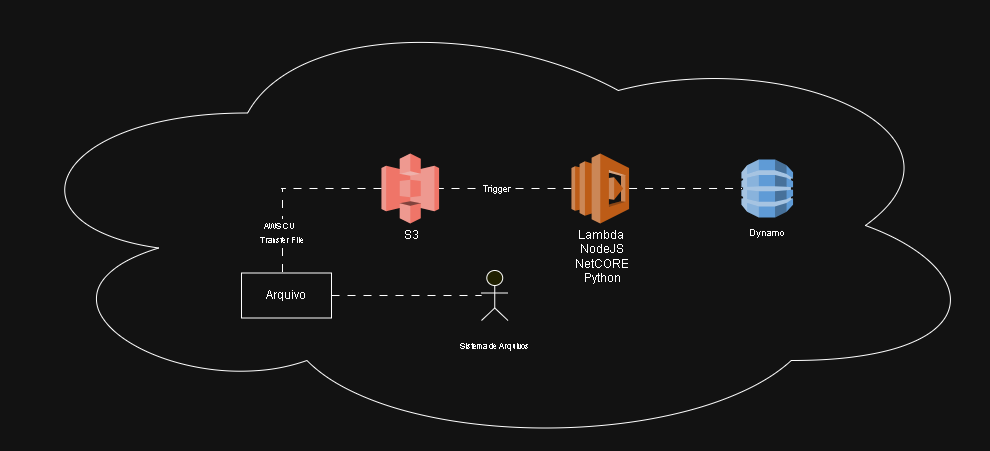

# AWS Cloud Architectures: DIO Challenge

## Sobre o Projeto
Repositório dedicado à documentação de arquiteturas em nuvem, desenvolvidas como parte dos desafios práticos da DIO para o curso de GFT - Fundamentos de Cloud com AWS. O foco foi explorar dois modelos distintos de infraestrutura AWS: **Serverless** (orientada a eventos) e **IaaS** (Infraestrutura como Serviço).

## Tecnologias Utilizadas
* **Draw.io:** Modelagem e documentação visual.
* **AWS S3:** Armazenamento de objetos e gatilho de eventos.
* **AWS Lambda:** Computação serverless.
* **AWS DynamoDB:** Banco de dados NoSQL.
* **AWS EC2:** Instâncias de computação.
* **AWS EBS:** Armazenamento em blocos para instâncias.

## Diagramas de Arquitetura

### 1. Arquitetura Serverless (S3, Lambda, DynamoDB)

* **Fluxo:** Upload de Arquivo → Trigger S3 → Processamento Lambda → Persistência no DynamoDB.

### 2. Arquitetura de Instância (EC2, EBS)

* **Fluxo:** Usuário/Aplicação → Instância EC2 → Armazenamento em Volumes EBS.### Imagens Técnicas
---
*Desenvolvido por reisexe :D*
